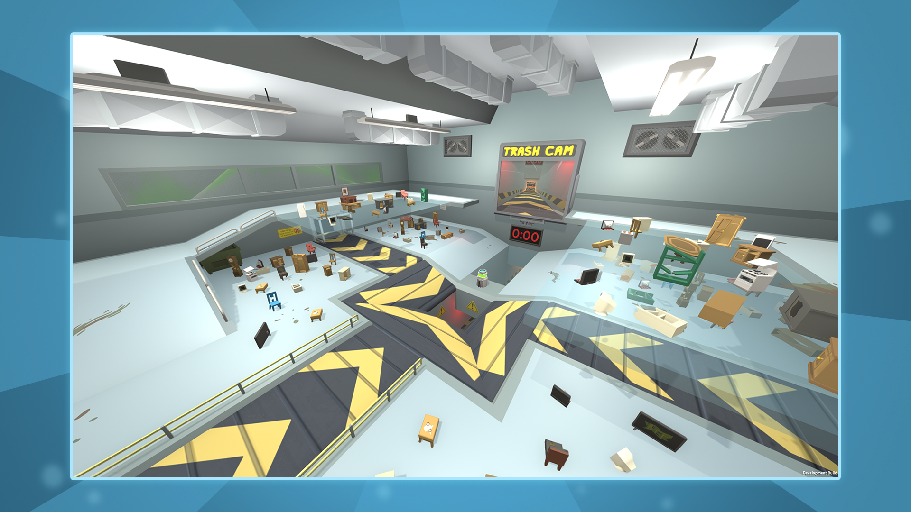
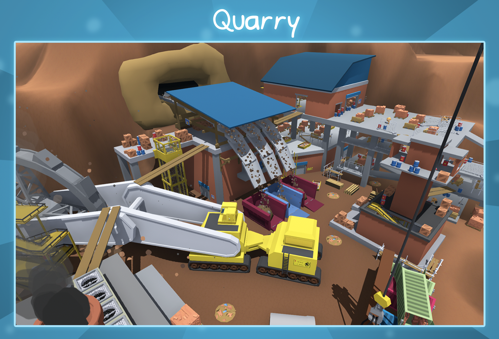

# Wobbly Life Mod Examples

In this mod examples package we have included a few mods which hopefully give
you a more in depth knowledge on how to make custom gamemodes for mods.

# Docs
[Wobbly Life Modding SDK](https://rubberbandgames.com/wobblylife/modsdkdocs/index.html)

# Trash Zone
Trash Zone is an asymmetric party game where one player (the Trasher) will attempt to knock the other players (the Trash) into a trash compactor to knock them out. 
They will do this by throwing objects down into the ‘Trash Zone’, launching them at the other players. 
The Trash players have to dodge these objects until the timer runs out.

**We have included a version of Trash Zone which you can use to make your own Trash Zone maps!**

# Hide and Seek
One player is the “Seeker”, and the rest of the players are the “Hiders”. 
When the game starts the Hiders have a short time to go find somewhere to hide. 
The Seeker stays behind a locked door while they go and hide.

Once the hiding timer reaches zero the door unlocks and the Seeker is released to go find the Hiders.

To catch a Hider the Seeker needs to grab them, and if the Seeker catches all the Hiders before the timer runs out then the Seeker wins. But if any Hiders manage to evade the Seeker until the timer runs out then they win.

When a Hider is caught, they will spectate until the end of the game.

**We have included a version of Hide and Seek which you can use to make your own Hide and Seek maps!**

# Disclaimer

**The content distributed within this project is for the purposes of modding Wobbly Life. Do not distribute or use assets for any other purpose.**